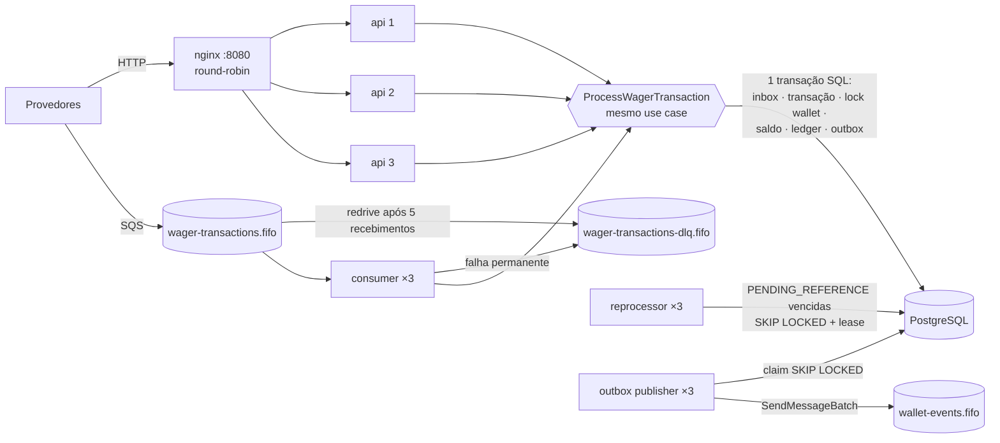

# Arquitetura — Distributed Wagering Processor

Este documento explica **como** o serviço garante as invariantes do desafio (nunca duplicar crédito/débito, nunca
perder evento confirmado, nunca permitir saldo negativo) com várias instâncias, entrega at-least-once e falhas de
processo/infraestrutura — e **por que** cada decisão foi tomada. A especificação técnica completa usada na
implementação está em `docs/plano/ESPECIFICACAO.md`; o histórico de decisões, fase a fase, em
`docs/plano/PROGRESSO.md`.

Mapa para a avaliação (§14 do enunciado):

| Área | Seções |
|---|---|
| Correção financeira (20) | [3 Money](#3-money), [2 Domínio](#2-modelo-de-domínio), [7 Schema](#7-schema-como-última-linha-de-defesa), [8 Reversões](#8-reversões-e-referências-fora-de-ordem) |
| Concorrência (20) | [5 Concorrência](#5-concorrência), [4 Transações](#4-orm-e-estratégia-transacional) |
| Idempotência (15) | [6 Idempotência](#6-idempotência) |
| Mensageria e falhas (15) | [10 Mensageria](#10-mensageria-inbox-outbox-retry-dlq-e-shutdown) |
| Modelagem e arquitetura (10) | [1 Visão geral](#1-visão-geral), [2 Domínio](#2-modelo-de-domínio) |
| Testes (10) | [13 Testes](#13-estratégia-de-testes) |
| Observabilidade (5) | [12 Observabilidade](#12-observabilidade) |
| Documentação (5) | este arquivo + `README.md` |

---

## 1. Visão geral

- **Uma imagem, vários papéis** (`APP_ROLE=api|consumer|outbox|reprocessor|all`). O Compose sobe 3 réplicas de cada
  papel; o nginx distribui o HTTP entre as APIs. Todo processo expõe `/health/*` e `/metrics`.
- **Um único caso de uso** (`ProcessWagerTransaction`) atende HTTP e SQS; o reprocessador usa o caminho "resolver
  pendente" do mesmo núcleo (`WAGERING_CORE_PROVIDERS`).
- **O banco é a fonte de verdade de todas as garantias**: idempotência, unicidade, lock por wallet, ledger
  append-only, consistência saldo ↔ ledger e a outbox ficam no PostgreSQL. O SQS FIFO (ordenação e dedup por
  grupo) é otimização.
- Camadas por feature: `domain/` (TypeScript puro, sem Nest/ORM) → `application/` (casos de uso e **portas**) →
  `infrastructure/` (MikroORM, SQS, Prometheus) → `http/`. Os módulos Nest só fazem wiring; nenhum módulo de feature
  importa outro (o núcleo compartilhado é uma lista de providers).

## 2. Modelo de domínio

Classes com construtor privado, factories (`create`/`open`/`from`) que validam e `rehydrate` (vinda do banco, sem
revalidar). Toda operação valida **antes** de mudar estado: um erro nunca deixa o objeto pela metade.

| Agregado / objeto | Responsabilidade e invariantes |
|---|---|
| `Money` (`src/shared/money`) | `bigint` de centavos + moeda; imutável; operações exigem a mesma moeda (`CURRENCY_MISMATCH`) |
| `Wallet` (aggregate root) | `debit`/`credit` são a **única** forma de mudar saldo e cada uma devolve o `WalletLedgerEntry` com `balanceBefore`, `balanceAfter` e `walletVersion` — saldo e ledger não divergem nem em memória; débito abaixo de zero → `InsufficientFundsError`; `version` incrementa a cada lançamento (abertura = 1) |
| `WalletLedgerEntry` | somente leitura; `create` garante `valor > 0`, `balanceBefore ± valor = balanceAfter`, `balanceAfter ≥ 0`, mesma moeda |
| `WagerTransaction` | campos de negócio imutáveis; máquina de estados explícita (tabela abaixo); calcula o próprio `payloadHash`; regras por kind (REFUND/ROLLBACK exigem referência; valor > 0 exceto LOSS; OPENING só por factory interna) |
| `ReversalPolicy` (serviço de domínio) | valida a referência (regras 7.2–7.5) e devolve a direção do lançamento ou o `FailureCode` |
| `InboxMessage`, `OutboxMessage`, `IntegrationEvent<T>` | ciclo recebida → processada (uma vez); pendente → publicada com backoff; eventos imutáveis com `eventType`/`version` no tipo e `data` só com `MoneyProps` |

### Transições de estado da `WagerTransaction`

| De \ Para | `PENDING_REFERENCE` | `PROCESSED` | `REJECTED` | `FAILED` |
|---|---|---|---|---|
| `PENDING` (só em memória, dentro da transação SQL) | ✅ referência ausente/pendente | ✅ | ✅ regra de negócio | ✅ |
| `PENDING_REFERENCE` | ✅ novo agendamento (`attempts++`) | ✅ referência resolvida | ✅ referência inválida ou TTL esgotado (`REFERENCE_NOT_FOUND`) | ✅ erros de infraestrutura esgotados (`PROCESSING_FAILED`) |
| `PROCESSED` / `REJECTED` / `FAILED` | ❌ | ❌ | ❌ | ❌ |

Estados terminais nunca mudam (`InvalidTransactionStateError` no domínio; trigger `trg_tx_immutable` no banco).
`PENDING` nunca fica visível depois do commit: no fluxo síncrono a transação sai da mesma transação SQL já
finalizada ou pendente de referência.

### Regras por kind

| Kind | Efeito | Referência |
|---|---|---|
| `BET` | débito; sem saldo → `REJECTED INSUFFICIENT_FUNDS` | opcional; se informada, validada como no WIN |
| `WIN` | crédito | opcional (BET da mesma rodada); se informada e ausente → `PENDING_REFERENCE` |
| `LOSS` | nenhum (aceita `0.00`), emite `WagerTransactionProcessed` | opcional, validada como no WIN |
| `REFUND` | crédito | obrigatória: **BET** `PROCESSED`, mesmo valor |
| `ROLLBACK` | inverso da referência | obrigatória: BET (→ crédito), WIN ou REFUND (→ débito), mesmo valor |

A referência é buscada por `(providerId, referenceExternalTransactionId)` e precisa ser do mesmo provider, player,
wallet, moeda e rodada (`REFERENCE_MISMATCH`), com valor igual em reversões (`REFERENCE_AMOUNT_MISMATCH`), já
processada (`REFERENCE_NOT_PROCESSED`) e não revertida antes (`ALREADY_REVERSED`). Reversão que deixaria o saldo
negativo → `REVERSAL_INSUFFICIENT_FUNDS` (distinto de `INSUFFICIENT_FUNDS`).

## 3. Money

- **Representação**: `bigint` de centavos + moeda ISO-4217 (3 letras maiúsculas). Nenhum `number` no caminho do
  dinheiro — parse e formatação são feitos sobre string e `bigint`.
- **Entrada estrita**: `^(0|[1-9]\d{0,17})\.\d{2}$`, sempre string com **exatamente 2 casas**. São rejeitados
  `"25"`, `"25.5"`, `"25.000"`, `1e3`, `NaN`, `Infinity`, número JSON (`25`), negativos e mais de 18 dígitos
  inteiros. Erros nunca ecoam o valor recebido.
- **Nunca arredonda**: como o que exigiria arredondamento é rejeitado na entrada e só há soma/subtração de centavos,
  não existe regra de arredondamento. `0.10 + 0.20 = 0.30` e 1.000.000 × `0.01` = `10000.00` são testados.
- **Limite**: resultados limitados a `NUMERIC(20,2)` (|valor| ≤ 999999999999999999.99); estouro é erro, não corte.
- **Banco**: `amount NUMERIC(20,2)` + `currency CHAR(3)` em colunas separadas. O driver `pg` devolve `numeric`
  como string; o tipo customizado `MoneyAmountType` valida a escala nos dois sentidos e o mapper monta o `Money`.
- **Fio**: JSON `{"amount":"25.00","currency":"BRL"}` em HTTP, SQS e eventos.

## 4. ORM e estratégia transacional

- **MikroORM 7** (a opção preferencial do enunciado), validado sob Bun num spike (F00). Metadata schema-first
  (`defineEntity`), sem depender de `emitDecoratorMetadata` para o ORM. Os *records* ficam na infraestrutura e
  viram objetos de domínio por mappers (`rehydrate`); o domínio não conhece o ORM.
- **Unit of Work explícita** (`UnitOfWork.run`): cada caso de uso abre um `EntityManager` *fork* novo (Identity Map
  vazio) dentro de `em.transactional()` e o expõe aos repositórios via `AsyncLocalStorage`. Escritas são nativas
  (`insert … on conflict do nothing returning`, `nativeUpdate`) e leituras sem Identity Map — nada de *flush*
  implícito nem entidade "suja" escondida; o SQL emitido é exatamente o que o caso de uso pede.
- **Isolamento `READ COMMITTED`** + `SET LOCAL lock_timeout` (`DB_LOCK_TIMEOUT_MS`, 3 s; o role `app` também tem
  3 s como defesa). READ COMMITTED basta porque toda decisão que depende do saldo acontece **sob o lock da wallet**
  e as unicidades são do schema; a reconciliação usa `REPEATABLE READ READ ONLY` (snapshot único de wallet + ledger).
- **Erros do PostgreSQL classificados** (`pg-errors.ts`): `40001`/`40P01`/`55P03`/conexão → transitório (HTTP 503 +
  `Retry-After`; SQS reentrega com backoff); `23505` com o nome da constraint → caminho de idempotência; `23503` na
  FK da wallet → `WALLET_NOT_FOUND`; `P0001` (triggers de imutabilidade) e `23514` da consistência no COMMIT → bug
  (500). Um *pool-guard* devolve ao pool conexões perdidas no meio de uma transação (bug do Kysely sob o MikroORM).
- **Dois roles**: `migrator` (DDL, roda as migrations) e `app` (só DML, e só `SELECT/INSERT` no ledger).

## 5. Concorrência

**Unidade de concorrência = `walletId`. Estratégia: lock pessimista da linha da wallet**
(`SELECT … FOR NO KEY UPDATE`) dentro da transação, com a `version` conferida no `UPDATE … WHERE version = :lida`
como guarda extra.

Por que pessimista e não otimista com retry ou update condicionado:

- **Hot wallet**: com optimistic, N operações simultâneas na mesma wallet geram N−1 conflitos, N−2 na rodada
  seguinte… — tempestade de retries justamente onde a carga está. O lock serializa a fila sem desperdiçar trabalho.
- **O processamento lê mais do que o saldo**: reversões consultam a referência e se ela já foi revertida; tudo isso
  precisa ser decidido sobre um estado estável. Um `UPDATE … SET balance = balance - x WHERE balance >= x` resolveria
  o débito simples, mas não a regra "uma reversão por referência" nem o snapshot de saldo para o replay.
- **Wallets diferentes nunca se esperam** (lock de linha, sem lock global, sem advisory lock compartilhado).

Detalhes:

- **`FOR NO KEY UPDATE`, não `FOR UPDATE`**: o INSERT da transação (feito antes do lock) verifica a FK `wallet_id` com
  `FOR KEY SHARE` na wallet; `FOR UPDATE` conflita com ele e duas operações da mesma wallet entravam em **deadlock**
  (achado no primeiro teste concorrente, mantido como regressão). `FOR NO KEY UPDATE` é o lock que o próprio
  `UPDATE wallets` toma: exclusivo entre escritores, compatível com a checagem de FK.
- **Ordem de locks** (evita deadlock entre processamento normal, reversões e reprocessador): (1) INSERT da própria
  linha de inbox e de idempotência → (2) **lock da wallet** → (3) leituras de transações relacionadas, **sem** lock.
  Toda mutação de algo da wallet acontece sob o lock dela; nunca se trava outra linha de transação.
- **Duplicatas concorrentes** (mesma key em 50 requisições) não chegam ao lock: esperam no índice único do INSERT até
  o vencedor commitar e então leem a linha (replay).
- **Lock timeout**: se a fila de uma wallet passa de 3 s, a operação falha como transitória (503 / redelivery) — sem
  efeito parcial, segura para reenviar com a mesma key. Deadlock (raro, pela ordem acima) é repetido uma vez
  internamente no HTTP; o SQS já reentrega.
- **Comportamento em hot wallet**: throughput daquela wallet = 1 / (duração da transação). Visível em
  `wallet_lock_wait_seconds` e `wallet_lock_conflicts_total{type="timeout"}`. Ver limitações (§14).

## 6. Idempotência

- **O header `Idempotency-Key` é a fonte da verdade** (no SQS, o campo `data.idempotencyKey` do envelope). Default
  recomendado: `{providerId}:{externalTransactionId}`. Até 200 caracteres.
- **Persistente e multi-instância**: `UNIQUE (idempotency_key)` + `UNIQUE (provider_id, external_transaction_id)` em
  `wager_transactions`. O caso de uso faz `INSERT … ON CONFLICT DO NOTHING` **antes** de qualquer efeito; o
  perdedor de uma corrida espera no índice até o vencedor commitar. Nenhum cache em memória.
- **Payload hash** = SHA-256 (hex minúsculo) do **JSON canônico** — chaves ordenadas recursivamente (ordem de code
  unit UTF-16, como o RFC 8785), sem espaços, opcionais ausentes omitidos (nunca `null`), números fracionários
  proibidos — de exatamente:
  `{providerId, externalTransactionId, playerId, walletId, roundId, gameId, kind, money:{amount, currency},
  referenceExternalTransactionId?}`. Header, `messageId`, `occurredAt` e a própria key ficam fora: **a mesma
  operação por HTTP e por SQS é replay**.
- **Replay × conflito** no INSERT:

  | Conflito em | Hash | Resultado |
  |---|---|---|
  | key ou `(provider, externalId)` | igual | **replay**: a resposta gravada (status, `failureCode`, saldo da época) com `idempotentReplay: true` — 200/202/422 |
  | mesma key | diferente | `409 IDEMPOTENCY_CONFLICT`, nada gravado |
  | mesmo `(provider, externalId)`, outra key | diferente | `409 EXTERNAL_ID_CONFLICT` |

- **Replay devolve o saldo original** (regra 7.7): toda transação finalizada guarda o snapshot `balance_after_amount`
  + `balance_after_currency` (moeda **da wallet**, inclusive em `CURRENCY_MISMATCH`). O replay não toca na wallet.
  `PENDING_REFERENCE` e `FAILED` não têm snapshot, e a resposta vem sem `balance`.
- **Inbox no SQS** (§10): deduplicação adicional por `(consumerName, messageId)` na mesma transação.

## 7. Schema como última linha de defesa

Migration `migrations/0001_init.ts` (com `down`). O código respeita as regras; o schema garante que nem um bug as
viole.

| Garantia | Constraint / índice / trigger |
|---|---|
| Saldo nunca negativo | `wallets.balance CHECK (balance >= 0)`; `wallet_ledger_entries.balance_before/balance_after CHECK (>= 0)` |
| Uma wallet por player e moeda | `uq_wallets_player_currency UNIQUE (player_id, currency)` |
| Idempotência | `uq_wager_transactions_idempotency_key`, `uq_wager_transactions_provider_external` |
| Um lançamento por transação; versões contíguas e únicas | `uq_ledger_transaction_wallet UNIQUE (transaction_id, wallet_id)`, `uq_ledger_wallet_version UNIQUE (wallet_id, wallet_version)` |
| Aritmética do lançamento | `ck_ledger_arithmetic`: `CREDIT ⇒ after = before + amount`, `DEBIT ⇒ after = before − amount`; `amount > 0` |
| Ledger append-only | trigger `trg_ledger_append_only` (BEFORE UPDATE/DELETE → erro, inclusive para o dono) + `app` sem `UPDATE/DELETE` no ledger |
| Saldo ↔ ledger | constraint trigger **diferida** `trg_wallet_ledger_consistency` (em `wallets` e no ledger): no COMMIT, saldo e versão da wallet = `balance_after`/`wallet_version` do último lançamento (ou saldo 0 sem lançamentos). Mudar saldo sem lançamento, ou o contrário, aborta o commit |
| Estados terminais e colunas de negócio imutáveis | trigger `trg_tx_immutable`: linha `PROCESSED/REJECTED/FAILED` não muda; nas demais, só as colunas que as transições alteram (lista de permitidas — coluna nova nasce imutável); DELETE proibido |
| Uma reversão por referência | índice único parcial `ux_reversal_once ON (reference_transaction_id) WHERE kind IN ('REFUND','ROLLBACK') AND status = 'PROCESSED'` |
| Regras por kind/status | `ck_wager_transactions_reversal_reference`, `ck_wager_transactions_positive_amount`, `ck_wager_transactions_failure_code` (`failure_code` ⇔ REJECTED/FAILED), `ck_wager_transactions_pending_reference_schedule`, `ck_wager_transactions_balance_after_pair`, CHECKs de `kind`/`status`/`direction`/moeda |
| Inbox deduplicada e preservada | PK `(consumer_name, message_id)` + `trg_inbox_no_delete` |
| Evento da outbox imutável | `trg_outbox_immutable` (payload, tipo, agregado, id, versão, datas); só o estado de publicação muda |
| Menor privilégio | `app`: `SELECT, INSERT, UPDATE` em wallets/transações/outbox/inbox; `SELECT, INSERT` no ledger; **nenhum DELETE** |

Cada linha tem teste de integração com SQL direto (`test/integration/schema`, 75 casos), inclusive como dono da
tabela.

## 8. Reversões e referências fora de ordem

- **Reversão única por referência, de qualquer tipo** (interpretação mais rígida que "uma por tipo"): REFUND e
  ROLLBACK da mesma BET não podem ambos creditar. O lock da wallet faz a segunda ver a primeira e responder
  `ALREADY_REVERSED`; o `ux_reversal_once` é a barreira final (violação → nova passada → `ALREADY_REVERSED`).
- **Referência ainda não chegou** (ou está pendente): a operação é gravada `PENDING_REFERENCE` (HTTP 202, evento
  `WagerTransactionPendingReference`) com `attempts`/`next_attempt_at`.
- **Reprocessador** (papel `reprocessor`, a cada 1 s): transação curta pega até 50 ids vencidos com
  `FOR UPDATE SKIP LOCKED` e empurra `next_attempt_at` (lease de 30 s) — instâncias pegam conjuntos disjuntos; depois,
  cada id roda em transação própria: lock da wallet → relê a linha (ignora se já não estiver pendente) → mesma
  estratégia por kind do fluxo síncrono. Não resolveu → `attempts++` e backoff exponencial (2 s · 2ⁿ, teto 5 min,
  jitter só para baixo), sem evento novo.
- **Atalho**: ao processar uma transação, as pendentes **da mesma wallet** que esperam por ela têm `next_attempt_at`
  antecipado para agora, na mesma transação — a resolução sai no próximo ciclo, não no próximo backoff.
- **TTL 30 min / máx. 12 tentativas** (o que vier primeiro; com os defaults, o TTL): esgotado → `REJECTED
  REFERENCE_NOT_FOUND` + `WagerTransactionRejected`. Justificativa: provedores costumam entregar a referência em
  segundos; 30 min cobre com folga a janela de retry + DLQ do SQS (5 recebimentos com backoff). Configurável
  (`PENDING_REFERENCE_TTL_MS`, `…_MAX_ATTEMPTS`, `…_BACKOFF_*`).
- Referência de **outro provider** nunca é encontrada (a busca inclui o provider) e expira como
  `REFERENCE_NOT_FOUND`. Uma cadeia de pendências (WIN pendente referenciando BET pendente) se resolve em cascata.
- `FAILED PROCESSING_FAILED` só para uma transação pendente que esbarra repetidamente em erro não-de-negócio até
  esgotar o limite (sem evento — a lista mínima não cobre FAILED; fica auditável e logado).

## 9. Taxonomia de falhas e status HTTP

Corpo de erro uniforme `{"error":{"code","message","retryable","correlationId"}}` (+ `details` com o caminho dos
campos em `VALIDATION_ERROR`). Rejeições de negócio **não** são erro: voltam com o corpo da transação.

| `failureCode` | Classe | Persistido | HTTP | Ação recomendada ao provedor |
|---|---|---|---|---|
| `INSUFFICIENT_FUNDS` | negócio | REJECTED | 422 | desistir (não reenviar) |
| `REVERSAL_INSUFFICIENT_FUNDS` | negócio | REJECTED | 422 | investigação operacional |
| `CURRENCY_MISMATCH`, `WALLET_PLAYER_MISMATCH` | negócio | REJECTED | 422 | corrigir o payload (nova operação) |
| `REFERENCE_MISMATCH`, `REFERENCE_AMOUNT_MISMATCH`, `REFERENCE_KIND_NOT_ALLOWED` | negócio | REJECTED | 422 | corrigir o payload |
| `REFERENCE_NOT_PROCESSED`, `ALREADY_REVERSED` | negócio | REJECTED | 422 | desistir |
| `REFERENCE_NOT_FOUND` | negócio (após TTL) | REJECTED | 422 (replay) / evento | enviar a referência e depois uma nova operação |
| `VALIDATION_ERROR`, `MISSING_IDEMPOTENCY_KEY`, `KIND_NOT_ALLOWED` | contrato | não | 400 | corrigir o payload |
| `IDEMPOTENCY_CONFLICT`, `EXTERNAL_ID_CONFLICT`, `WALLET_ALREADY_EXISTS` | conflito | não | 409 | nova key / corrigir / usar a wallet existente |
| `WALLET_NOT_FOUND` (sem alvo de FK, não persiste), `TRANSACTION_NOT_FOUND` | não encontrado | não | 404 | corrigir |
| `TRANSIENT_UNAVAILABLE` | transitório | não | 503 + `Retry-After` | **reenviar com a mesma key** (único `retryable: true`) |
| `PROCESSING_FAILED` | infraestrutura | FAILED | 500 (replay) | investigação operacional |

Sucesso: 201 nova / 200 replay; 202 `PENDING_REFERENCE` (nova ou replay). O mapeamento é por **classe** do código
(`failure-http-status.ts`) e vale igual em todos os endpoints. No SQS a mesma taxonomia decide ack × retry × DLQ
(§10).

## 10. Mensageria: inbox, outbox, retry, DLQ e shutdown

### Consumidor (`wager-transactions.fifo`)

- Envelope `{messageId, type:"WagerTransactionRequested", occurredAt, data}`; `data` = o mesmo schema do corpo HTTP
  + `idempotencyKey`. Long-poll (20 s, até 10 mensagens), grupos (`MessageGroupId` = wallet) diferentes em
  paralelo, mesmo grupo em sequência; até `SQS_CONSUMER_MAX_IN_FLIGHT` (50) mensagens em andamento por instância,
  sem esperar o lote terminar para pedir o próximo.
- **Inbox na mesma transação**: passo 1 do caso de uso insere `(consumerName, messageId, payloadHash)` com
  `ON CONFLICT DO NOTHING`; passo 8 marca processada. Conflito com o mesmo hash = mensagem já processada → ack sem
  efeito (`inbox_duplicates_total`); hash diferente = `INBOX_CONFLICT` (permanente).
- **Ack (`DeleteMessage`) só depois do commit.** Morte entre commit e ack → redelivery → inbox → sem segundo efeito
  (testado com fault hook e `SIGKILL`).
- **Classificação** (`error-classifier.ts`):

  | Situação | Destino |
  |---|---|
  | sucesso, rejeição de negócio, `PENDING_REFERENCE`, replay, duplicata de inbox | **ack** |
  | PG fora/deadlock/lock timeout, SQS indisponível, erro inesperado | **retry**: sem ack, `ChangeMessageVisibility` = 1 s · 2^(recebimentos−1) (teto 5 min); depois de `maxReceiveCount` (5) o **redrive** do SQS move para a DLQ |
  | envelope inválido, `type` desconhecido, `data` inválido, OPENING, wallet inexistente, conflito de idempotência/inbox | **DLQ explícita**: cópia com `failureReason` e `originalMessageId` (mesmo grupo) e delete |

  Erro inesperado é tratado como transitório de propósito: um soluço passa na próxima entrega e um bug persistente
  chega à DLQ sozinho pelo redrive, sem perder a mensagem.
- **SIGTERM**: a readiness passa a 503 já no primeiro hook; o long-poll é abortado; nenhuma mensagem nova começa; as
  em andamento têm até `SHUTDOWN_GRACE_MS` (20 s) para terminar; o que sobrar volta com visibilidade 0 para outra
  instância; depois fecham ORM e cliente SQS. Se uma transação ainda em voo commitar depois da devolução, a
  redelivery cai na inbox.

### Outbox transacional (`wallet-events.fifo`)

- Eventos (`WagerTransactionProcessed|Rejected|PendingReference`, `WalletBalanceChanged`) são gravados em
  `outbox_messages` **na mesma transação SQL** do efeito — nada é publicado antes do commit, e transação abortada
  não gera evento.
- Publisher (a cada 250 ms, adaptativo): numa transação, `SELECT … WHERE published_at IS NULL AND next_attempt_at
  <= now() ORDER BY occurred_at LIMIT 50 FOR UPDATE SKIP LOCKED` → `SendMessageBatch` (`MessageGroupId` = wallet,
  `MessageDeduplicationId` = `eventId`) → `markPublished`/`scheduleRetry` → commit. Publishers concorrentes pegam
  lotes disjuntos.
- **At-least-once**: se o publisher morre depois de publicar e antes do commit, os locks caem com a conexão e outro
  publica de novo — duplicata com o mesmo `eventId`, que o consumidor deduplica. Falha nunca descarta (backoff até
  5 min; alerta acima de 10 tentativas).
- `aggregateId` de todos os eventos = `walletId`: a ordem entre `…Processed` e `WalletBalanceChanged` da mesma
  wallet se mantém no FIFO.

### O papel do FIFO

Ordenação por grupo e dedup de 5 min do broker são **otimizações**: o banco não depende delas (inbox, idempotência,
lock e `PENDING_REFERENCE` cobrem duplicata, fora de ordem e concorrência). O preço aceito é head-of-line por wallet
(§14).

## 11. Autenticação

**Não implementada** — vale 0 ponto e o enunciado aceita a decisão documentada. O ponto de extensão está no código:

- `ProviderIdentityPort.resolve(request) → { providerId } | null` (`src/auth/provider-identity.port.ts`);
- `NoopProviderAuthGuard` aplicado nos controllers de provedor (wallets e transações), **não** em health/metrics;
  hoje aceita tudo e grava `request.providerIdentity = null`.
- SQS é tratado como canal interno confiável, mas o `providerId` da mensagem passa pelas mesmas validações de
  domínio (a referência só é achada no mesmo provider, etc.).

Desenho adotado se fosse implementar: **Keycloak** no Compose com um *client* `confidential` por provedor (OAuth2
*client credentials*). O guard real valida o JWT (assinatura via JWKS do realm, `iss`, `aud`, `exp`), mapeia a claim
`azp` (client id) → `providerId` e exige que o `providerId` do corpo seja o do token (403 se não; 401 sem token). Os
endpoints de leitura de wallet ganhariam escopos próprios. Nenhuma tabela de usuários/senhas no serviço.

## 12. Observabilidade

Resumo (detalhes, exemplos e diagnóstico em **[docs/observabilidade.md](docs/observabilidade.md)**):

- **Logs JSON** (pino) com `correlationId`, `causationId`, `messageId`, `transactionId`, `walletId`, `providerId`,
  `instanceId`, `kind`, `status`, `failureCode` e `durationMs`, propagados por `AsyncLocalStorage` em HTTP, consumidor,
  publisher e reprocessador. **Redaction** de valores, saldos, corpos e payloads (testado com `LOG_LEVEL=debug`).
- **Métricas** Prometheus por processo (label `instance`): `wager_transactions_total{kind,status,failure_code,source}`,
  `idempotent_replays_total`, `inbox_duplicates_total`, `sqs_retries_total`, `sqs_dlq_messages_total{reason}`,
  `wallet_lock_conflicts_total{type}`, `wallet_lock_wait_seconds`, `processing_duration_seconds{source,kind}`,
  `outbox_lag_seconds`, `outbox_pending`, `outbox_publish_failures_total`, `pending_references`,
  `reconciliation_mismatches_total`. Gauges de banco por coleta periódica (5 s), nunca no scrape.
- **Health**: `/health/live` (processo) e `/health/ready` (PG + SQS com timeout, e não estar em shutdown).
- **Reconciliação** (`POST /wallets/:id/reconciliation`): `REPEATABLE READ READ ONLY`, Σ créditos − Σ débitos e
  verificação da cadeia (versões contíguas, `balance_before` = `balance_after` anterior, último lançamento = wallet).
  Divergência → `consistent:false`, log `warn` e métrica; nunca corrige sozinha.

## 13. Estratégia de testes

Bun test. Integração e concorrência usam **PostgreSQL e SQS reais** (`docker-compose.test.yml`); nada de mock de
banco ou fila. Todo teste de integração/concorrência termina com `assertLedgerInvariant` (saldo = Σ ledger, versões
contíguas, encadeamento, nada negativo — calculado no PostgreSQL sobre `NUMERIC`) e, quando há API, com a
reconciliação HTTP `consistent: true`. Determinismo: PRNG com seed fixa, espera por condição (nunca `sleep`
arbitrário), filas isoladas por teste.

| Suíte | O que prova | §13 do enunciado |
|---|---|---|
| `test/unit` (~730) | `Money` (escala, inválidos, sem arredondamento, BRL×USD), `Wallet`, transições, `ReversalPolicy` (matriz kind × referência), payload hash, eventos, envelope SQS, classificação de erros, config | unidade |
| `test/integration/schema` | cada constraint/trigger dispara (inclusive como dono), migrations up → down → up, grants | migrations e constraints |
| `test/integration/persistence` | lock serializa, 20 inserts concorrentes → 1, `SKIP LOCKED` disjunto, erros do PG classificados | — |
| `test/integration/wallet`, `wagering`, `reversal` | regras, idempotência, replay com saldo original, atomicidade com falha injetada no meio (nada persiste) | atomicidade wallet/ledger/inbox/outbox |
| `test/integration/sqs` | inbox e redelivery, duplicatas, DLQ por motivo, PG fora → retry → processado uma vez, redrive após 5, morte entre commit e ack, SIGTERM com mensagens em voo | inbox e redelivery; retry e DLQ; recuperação |
| `test/integration/outbox` | nada antes do commit, 2 publishers em processos separados, morte antes do commit, SQS fora (proxy TCP) | publishers concorrentes |
| `test/integration/observability` | cada métrica no cenário que a move; logs sem valores e com os ids | — |
| `test/concurrency/single-process` | mesma BET 50×, 100 + 2×80 (×20), carga mista, REFUND × ROLLBACK em paralelo | 1, 2, 3 |
| `test/concurrency/multi-instance` | **processos `bun src/main.ts` reais**: mesma BET 50× em 3 APIs; 100 + 2×80 em APIs diferentes ×20; 50 wallets × 20 ops em 3 APIs; 3 APIs + 3 consumidores + 2 publishers + 2 reprocessadores com carga mista e duplicatas; consumidor morto entre commit e ack; publisher morto com `SIGKILL`; REFUND/ROLLBACK antes da BET por instâncias diferentes (+ expiração); `SIGKILL` em todos os processos no meio da carga → reinício → tudo consistente, fila/DLQ vazias, outbox zerada | 1–8 |

Tempos de referência (2 vCPU): unidade ~1 s, integração ~80 s, concorrência ~2 min (rodada 3× seguidas sem falha).

## 14. Trade-offs e limitações

- **Throughput de hot wallet é limitado pela serialização**: operações da mesma wallet passam uma de cada vez pelo
  lock (por desenho). Muito acima disso, a fila de espera estoura o `lock_timeout` (3 s) e vira 503/redelivery —
  correto, mas com latência. Wallets diferentes escalam em paralelo.
- **Head-of-line do FIFO por wallet**: uma mensagem com falha transitória segura as seguintes da mesma wallet até o
  backoff/redrive. Aceito: ordem por wallet é desejável e as demais wallets seguem.
- **Reversão parcial fora de escopo**: REFUND/ROLLBACK exigem o valor exato da referência.
- **Sem partidas dobradas**: o ledger é por wallet (débito/crédito com saldo antes/depois), não um razão
  contábil com contrapartida (casa/jogador). Auditável e reconciliável, mas não é contabilidade completa.
- **Sem autenticação** (ver §11).
- **`FAILED` sem evento** e reprocessamento manual de DLQ não automatizado (as mensagens ficam com o motivo).
- **Fila de entrada só recebe**; a DLQ não tem consumidor nem tela — inspeção via AWS CLI.
- **Pool de conexões no default do MikroORM (10 por processo)**; com 12 processos o PostgreSQL do Compose precisa de
  `max_connections=300` (configurado). Sem PgBouncer.
- **Contadores por processo**: totais do sistema são somas no Prometheus; os gauges de banco só existem nos papéis
  que os coletam.
- **LocalStack fixado em 4.14** (última versão sem token; as releases 2026.x pedem `LOCALSTACK_AUTH_TOKEN`).
- Teste de carga ainda não feito (próxima fase).

## 15. Interpretações adotadas

Pontos em que o enunciado deixa margem e a escolha feita:

1. Entrada monetária estrita com **2 casas** (`"25"` é inválido) e sempre string.
2. **Uma reversão por referência, de qualquer tipo** (REFUND + ROLLBACK da mesma BET não creditam duas vezes).
3. **WIN, BET e LOSS com referência opcional**; se informada, validada como no WIN (só BET, mesmo escopo, sem
   conferir valor) ou fica pendente.
4. WIN/BET/LOSS que referenciam uma BET **já revertida** → `REJECTED ALREADY_REVERSED`.
5. Snapshot de saldo gravado **na moeda da wallet**, inclusive em `CURRENCY_MISMATCH`.
6. **LOSS aceita `0.00`** e não gera lançamento.
7. `WALLET_NOT_FOUND` não é persistido (não há wallet para a FK); é detectado pela própria FK no INSERT.
8. `FAILED` só para transação persistida com retries de infraestrutura esgotados.
9. `PENDING` nunca fica visível após o commit no fluxo síncrono.
10. Mesma operação (mesmo hash) com **outra key** mas o mesmo `(providerId, externalTransactionId)` é **replay**; só
    payload diferente vira `EXTERNAL_ID_CONFLICT`.
11. Respostas `PENDING_REFERENCE` (202) e replay de `FAILED` (500) vêm **sem `balance`** (não há snapshot).
12. Referência de outro provider nunca é encontrada → expira como `REFERENCE_NOT_FOUND`.
13. Esgotado o TTL, a pendência vira `REFERENCE_NOT_FOUND` mesmo que a referência exista mas continue pendente.
14. Transação que referencia o próprio `externalTransactionId` → `VALIDATION_ERROR`.
15. Na `ReversalPolicy`, a primeira regra que falha decide, na ordem: referência ausente/pendente → não processada →
    kind → escopo → valor → já revertida. `gameId` não faz parte do escopo (a regra 7.2 não o cita).
16. `POST /wallets` sem saldo inicial abre com `0.00` e exige `currency`; com saldo, as moedas precisam bater.
17. No SQS, erro inesperado é transitório (retry até o redrive), não DLQ imediata.
18. `aggregateId` de todos os eventos é a `walletId` (ordem por wallet no FIFO); o id da transação vai em `data`.
19. Backoff com jitter **só para baixo** (o teto nunca é ultrapassado).
20. A reconciliação é `POST` (como no enunciado), mas nunca escreve.
